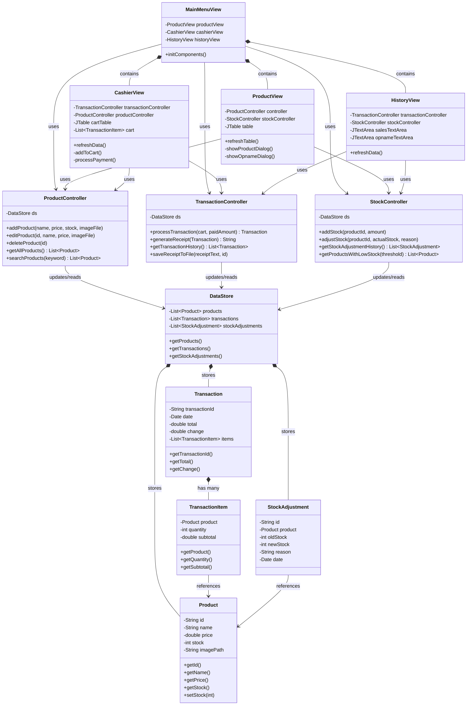

# POS (Point of Sale) Application

Aplikasi Kasir (Point of Sale) modern yang dibangun menggunakan Java Swing dengan pola arsitektur MVC (Model-View-Controller). Aplikasi ini dirancang dengan antarmuka pengguna (UI) yang sangat bersih (*clean*), serba putih, dan minimalis layaknya aplikasi kasir modern.

## Fitur Utama

### 1. Manajemen Produk & Stok (`ProductView`)
- **CRUD Produk:** Tambah, Edit, dan Hapus produk.
- **Tampilan Tabel Modern:** Desain tabel tanpa garis vertikal dengan jarak baris yang lega.
- **Stok Opname:** Fitur penyesuaian stok fisik (menambah/mengurangi stok) yang tercatat secara logis.
- **Validasi Cerdas:** Mencegah input kosong atau format angka yang salah.

### 2. Layar Kasir / Pembayaran (`CashierView`)
- **Pencarian Produk:** Cari produk berdasarkan nama secara langsung.
- **Grid Produk Interaktif:** Menampilkan produk dalam bentuk *card* yang bisa diklik untuk dimasukkan ke keranjang.
- **Keranjang Pintar (Auto-Merge):** Jika barang yang sama ditambahkan, sistem otomatis menambahkan kuantitas (*qty*) tanpa membuat baris baru.
- **Manajemen Keranjang:** Fitur ubah *quantity* (Qty) dan hapus *item* dari keranjang belanja.
- **Kalkulator Kembalian Otomatis (*Real-Time*):** Menghitung kembalian secara langsung setiap kali nominal uang diketik pada kolom pembayaran, dilengkapi dengan indikator warna (merah jika kurang, hijau jika pas/lebih).
- **Cetak Struk:** Menghasilkan struk transaksi dengan format modern (mirip struk minimarket) dan menyimpannya secara otomatis dalam folder `receipts/` berekstensi `.txt`.

### 3. Riwayat Sistem (`MainMenuView`)
- **Riwayat Transaksi:** Mencatat dan menampilkan seluruh riwayat penjualan (POS) yang telah berhasil beserta detail waktunya.
- **Riwayat Opname:** Mencatat setiap aktivitas penyesuaian stok (penambahan/pengurangan) secara manual beserta alasan atau catatannya.

### 4. Arsitektur MVC
- **Model:** Mengatur struktur data (`Product`, `Transaction`, `TransactionItem`, `StockAdjustment`, `DataStore`).
- **View:** Mengatur antarmuka pengguna (`MainMenuView`, `CashierView`, `ProductView`, `HistoryView`).
- **Controller:** Mengatur logika bisnis dan alur data (`ProductController`, `TransactionController`, `StockController`).

## Struktur Direktori
```text
uas/
├── images/                 # Folder tempat menyimpan gambar produk
├── receipts/               # Folder tempat struk (.txt) otomatis disimpan
├── src/
│   ├── controller/         # Logika Aplikasi
│   │   ├── ProductController.java
│   │   ├── StockController.java
│   │   └── TransactionController.java
│   ├── model/              # Struktur Data & Mock Database
│   │   ├── DataStore.java       
│   │   ├── Product.java
│   │   ├── StockAdjustment.java
│   │   ├── Transaction.java
│   │   └── TransactionItem.java
│   ├── view/               # Antarmuka Pengguna (UI)
│   │   ├── CashierView.java
│   │   ├── HistoryView.java
│   │   ├── MainMenuView.java
│   │   └── ProductView.java
│   └── Main.java           # Entry Point Aplikasi
└── README.md               # Dokumentasi Proyek
```

## Diagram Class (Relasi MVC)
Berikut adalah gambaran interaksi antar kelas (Class Diagram) beserta atribut dan metodenya dalam arsitektur sistem ini:



## Cara Menjalankan Aplikasi

1. **Prasyarat:** Pastikan Anda sudah menginstal Java Development Kit (JDK) minimal versi 8.
2. Buka Terminal / Command Prompt.
3. Arahkan direktori (cd) ke dalam folder proyek ini.
4. Lakukan kompilasi seluruh file Java:
   ```bash
   javac -sourcepath src -d bin src/Main.java
   ```
5. Jalankan aplikasi:
   ```bash
   java -cp bin Main
   ```

## Catatan Teknis
- **Penyimpanan:** Saat ini aplikasi menggunakan `DataStore.java` sebagai *In-Memory Database* sementara untuk mempermudah demonstrasi. Jika aplikasi ditutup, data akan hilang (kecuali file struk transaksi yang disimpan di dalam *folder* `receipts`).
- **Antarmuka:** Seluruh komponen antarmuka dibangun secara murni (Native) menggunakan bawaan Java Swing tanpa *library* desain eksternal, dengan memaksimalkan penggunaan manipulasi `Border`, `Color`, dan `LayoutManager`.

---
*Dibuat untuk keperluan Tugas Akhir Pemrograman Lanjut*
